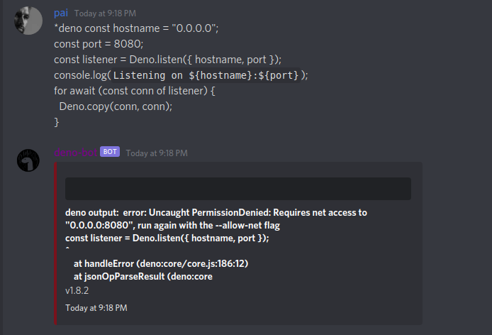

# dino


a bot that execute deno and send you the output


- secure by default



create a archive call token.ts

and put

```
export let token:string = "" // your discord token
```

and finally run
```
deno run -A -q --unstable mod.ts
```


